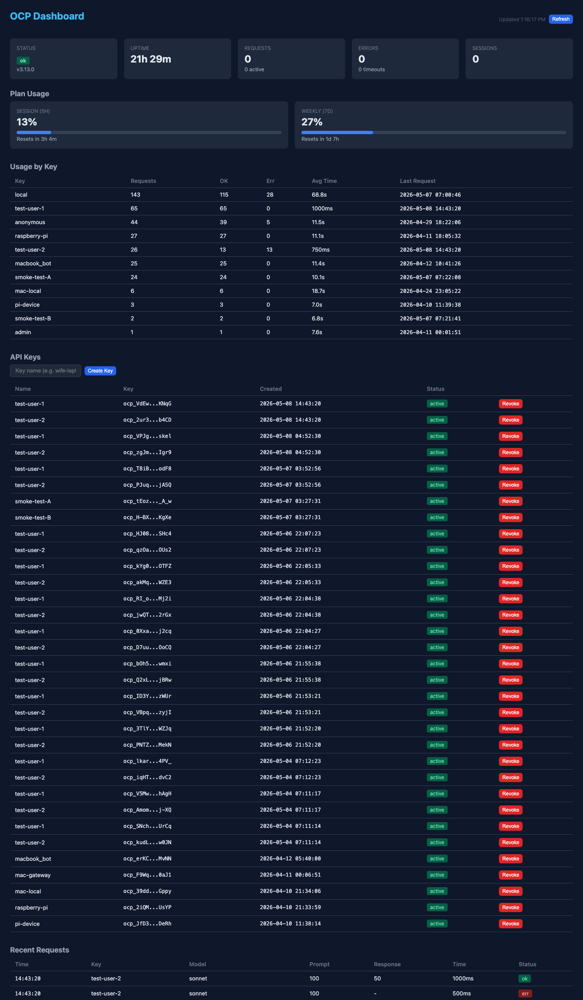

# OCP — Open Claude Proxy

[](LICENSE) [](https://github.com/dtzp555-max/ocp/releases) [](https://buymeacoffee.com/dtzp555)

> **Already paying for Claude Pro/Max? Use your subscription as an OpenAI-compatible API — $0 extra cost.**

*Open source from day one, used daily by my family, maintained on nights and weekends. If OCP saves you money too, you can [☕ buy me a coffee](https://buymeacoffee.com/dtzp555) — [full story below](#support-ocp).*

*If OCP saves you a setup, a ⭐ helps other folks discover it. Issue reports are even more useful — that's the highest-quality feedback this project gets.*

OCP turns your Claude Pro/Max subscription into a standard OpenAI-compatible API on localhost. Any tool that speaks the OpenAI protocol can use it — no separate API key, no extra billing.

```
Cline          ──┐
OpenCode       ───┤
Aider          ───┼──→ OCP :3456 ──→ Claude CLI ──→ Your subscription
Continue.dev   ───┤
OpenClaw       ───┘
```

One proxy. Multiple IDEs. All models. **$0 API cost.**

## Why OCP?

There are several Claude proxy projects. OCP picks a specific lane: **align tightly with what `cli.js` actually does, observe + multiplex what's already there, don't extend the protocol.** What you get:

- **LAN multi-user keys** (v3.7.0) — share one Claude Pro/Max subscription with family, friends, or your own devices. Each user gets a per-key API token (no OAuth session leak), with independent usage tracking and one-line revocation.
- **`ocp-connect` one-shot IDE setup** — one command on the client machine detects and configures Claude Code, Cursor, Cline, Continue.dev, OpenCode, and OpenClaw. No pasting `OPENAI_BASE_URL` six times.
- **Response cache with per-key isolation + singleflight** (v3.13.0). Optional SHA-256 prompt cache, isolated per API key (cross-user pollution is impossible by hash construction, not by application logic), with stampede protection on concurrent identical prompts. Off by default. ([PR #65](https://github.com/dtzp555-max/ocp/pull/65), [PR #66](https://github.com/dtzp555-max/ocp/pull/66))
- **Per-key request quotas** (v3.8.0). Daily / weekly / monthly limits per key — set a kid's iPad to 20/day, a partner's laptop to 100/week. ([PR #18](https://github.com/dtzp555-max/ocp/pull/18))
- **SSE heartbeat for long reasoning** ([v3.12.0](https://github.com/dtzp555-max/ocp/releases/tag/v3.12.0), opt-in). If you've ever watched your IDE die at the 60s idle mark during a long Claude tool-use pause — that's nginx/Cloudflare default behavior. OCP emits an SSE comment frame to keep the connection alive without polluting the response. ([PR #49](https://github.com/dtzp555-max/ocp/pull/49))
- **`cli.js` alignment + CI guardrail.** LLM-assisted code drifts easily — it's tempting to invent plausible-looking endpoints that `cli.js` doesn't actually use. [`ALIGNMENT.md`](./ALIGNMENT.md) is binding: every endpoint OCP exposes must cite a `cli.js` line. The [`alignment.yml`](./.github/workflows/alignment.yml) CI workflow blocks PRs that introduce known-hallucinated tokens. The payoff is boring: your setup keeps working when `cli.js` ships its next minor.
- **`models.json` single source of truth** (v3.11.0). Adding a model is one file edit; both `/v1/models` and the OpenClaw bootstrap derive from it. ([PR #30](https://github.com/dtzp555-max/ocp/pull/30))

### Comparison

OCP and the alternatives serve adjacent but distinct needs. Pick the one that fits your use case:

| Feature | OCP | claude-code-router | anthropic-proxy |
|---|---|---|---|
| Forwards Claude Code subscription as OpenAI API | yes | yes | yes |
| Routes to multiple model backends (OpenAI, Gemini, etc.) | no | yes | partial |
| SSE heartbeat for long reasoning | yes (opt-in) | no | no |
| Per-key quota + LAN multi-user keys | yes | no | no |
| Response cache | yes (opt-in) | no | no |
| OpenClaw / IDE auto-config | yes | no | no |
| Model-routing rules / model-switching | no | yes | no |
| GitHub stars / ecosystem size | small | large | mid |
| Governance discipline (CI-enforced alignment with cli.js) | yes | n/a | n/a |

**Plain English**: `claude-code-router` is the routing-and-switching power tool — pick it if you want to mix Anthropic, OpenAI, Gemini, and local models behind one endpoint. `anthropic-proxy` is the minimal forwarder. **OCP focuses on disciplined `cli.js`-aligned forwarding plus subscription multiplexing** — pick it if you want to share one Claude Pro/Max subscription across IDEs, devices, and people, with LAN auth, quotas, and a governance contract that prevents endpoint drift.

OCP is single-maintainer + LLM-assisted, currently pre-1.0. It runs the maintainer's daily Claude Code workflow. If something breaks, [open an issue](https://github.com/dtzp555-max/ocp/issues).

## Supported Tools

Any tool that accepts `OPENAI_BASE_URL` works with OCP:

| Tool | Configuration |
|------|--------------|
| **Cline** | Settings → `OPENAI_BASE_URL=http://127.0.0.1:3456/v1` |
| **OpenCode** | `OPENAI_BASE_URL=http://127.0.0.1:3456/v1` |
| **Aider** | `aider --openai-api-base http://127.0.0.1:3456/v1` |
| **Continue.dev** | config.json → `apiBase: "http://127.0.0.1:3456/v1"` |
| **OpenClaw** [^openclaw] | `setup.mjs` auto-configures |
| **Any OpenAI client** | Set base URL to `http://127.0.0.1:3456/v1` |

[^openclaw]: **OpenClaw** is an IDE-agnostic AI coding agent (sibling project to OCP). When OCP runs on the same machine, OpenClaw can use it as a local provider — see `scripts/sync-openclaw.mjs` and ADR 0004.

## Installation

The simplest path: ask your AI.

  Paste this prompt to Claude Code / Cursor / Copilot:

  ```
  Install OCP for me. Read README §Manual Installation and follow it.
  Tell me when I need to run `claude auth login`.
  ```

The AI will run `git clone`, `npm install`, `node setup.mjs`, and tell you
when to OAuth.

### Manual Installation

OCP has two roles: **Server** (runs the proxy, needs Claude CLI) and **Client** (connects to a server, zero dependencies).

```
┌─ Server (always-on device) ─────────────────────────────┐
│  Mac mini / NAS / Raspberry Pi / Desktop                │
│  Claude CLI + OCP server → bound to 0.0.0.0:3456       │
└───────────────────────┬─────────────────────────────────┘
                        │ LAN
    ┌───────────────────┼───────────────────┐
    ▼                   ▼                   ▼
 Laptop             Phone/Tablet        Pi / Server
 (client)           (browser)           (client)
```

---

### Quick install with AI assistance

If you've got Claude Code, Cursor, or any other AI coding assistant on this machine, you can copy-paste one of these prompts and let the AI walk through the install for you. Each prompt pins the AI to the right README section, names the verification step, and forbids silent retries — so you stay in the loop.

**Single-machine use** — install OCP for IDEs on this same machine only:

```text
I want to install OCP on this machine to use my Claude Pro/Max subscription
as an OpenAI-compatible API for local IDEs.

Please follow https://github.com/dtzp555-max/ocp/blob/main/README.md
"Server Setup" → "Single-machine use" path:

1. Verify prerequisites: macOS or Linux, Node.js 22.5+, git, Claude CLI
   installed and logged in (`claude auth status`). Install missing pieces
   using my system's package manager.
2. git clone the repo, cd in, and run `node setup.mjs`.
3. Verify with `curl http://127.0.0.1:3456/v1/models` (should list 4 models).
4. Add `export OPENAI_BASE_URL=http://127.0.0.1:3456/v1` to my shell rc.
5. Tell me to reload my shell and try a tool like Cline / Continue / Cursor.

Before each step, tell me what you'll run and wait for confirmation.
On any error, diagnose first — don't auto-retry.
```

**LAN mode (server)** — install OCP as a server so your family or multiple devices can share it:

```text
I want to install OCP on this device as a LAN server so my family and other
devices on the network can share my Claude Pro/Max subscription.

Please follow https://github.com/dtzp555-max/ocp/blob/main/README.md
"Server Setup" → "LAN mode" path:

1. Verify prerequisites: macOS or Linux (Windows not supported), Node.js
   22.5+, git, Claude CLI installed and authenticated.
2. Generate a strong admin key with `openssl rand -base64 32`. Save it —
   I'll need it to manage per-user keys later.
3. git clone https://github.com/dtzp555-max/ocp.git && cd ocp
4. Run `node setup.mjs --bind 0.0.0.0 --auth-mode multi`.
5. Add OCP_ADMIN_KEY to my shell rc (~/.zshrc or ~/.bashrc).
6. Run `ocp lan` to show me the LAN IP and connect command.
7. Optionally create example keys: `ocp keys add laptop`, `ocp keys add tablet`.
8. Verify: `curl http://127.0.0.1:3456/v1/models` returns 4 models.

Tell me each step before running it. On error, diagnose before retrying.
```

**Client connect** — configure this device to use an existing OCP server on your LAN:

```text
There's an OCP server at <SERVER_IP> on my LAN. Configure this machine to
use it for any local IDEs (Cursor, Cline, Continue.dev, OpenCode, Claude
Code, OpenClaw).

Server IP: <SERVER_IP>
API key (leave blank if the server has anonymous mode enabled): <OPTIONAL_KEY>

Please follow https://github.com/dtzp555-max/ocp/blob/main/README.md
"Client Setup" path:

1. Download ocp-connect:
     curl -fsSL https://raw.githubusercontent.com/dtzp555-max/ocp/main/ocp-connect -o ocp-connect
     chmod +x ocp-connect
2. Run `./ocp-connect <SERVER_IP>` (add `--key <KEY>` if you have one).
3. Follow any IDE-specific manual hints it prints.
4. Verify: `curl http://<SERVER_IP>:3456/v1/models` returns 4 models.
5. Tell me to reload my shell + restart any IDE that was already running.

Don't auto-retry on error. Tell me the failure mode first.
```

> If you'd rather do everything manually, the **Server Setup** and **Client Setup** sections below have the same steps in handbook form.

---

### Server Setup

> **Recommended:** Install OCP on a device that stays powered on — Mac mini, NAS, Raspberry Pi, or a desktop that doesn't sleep. This ensures all clients always have access.

**Prerequisites:**
- macOS or Linux (Windows is not supported — `setup.mjs` installs launchd / systemd auto-start)
- Node.js 22.5+ (Node 23+ recommended — `node:sqlite` is fully stable without flags from 23.0; on 22.5–22.x it works behind `--experimental-sqlite`)
- `git`
- [Claude CLI](https://docs.anthropic.com/en/docs/claude-cli) — install and authenticate:
  ```bash
  npm install -g @anthropic-ai/claude-code
  claude auth login   # prints a URL + code — open URL on any browser, sign in, paste code back
  ```
  Headless servers (Pi / NAS / VPS without a desktop browser): see [Headless install notes](#headless-install-notes) below.

```bash
# 1. Clone and run setup
git clone https://github.com/dtzp555-max/ocp.git
cd ocp
node setup.mjs
```

The setup script will:
1. Verify Claude CLI is installed and authenticated
2. Start the proxy on port 3456
3. Install auto-start (launchd on macOS, systemd on Linux)

After install the `ocp` CLI lives at `~/ocp/ocp`. To put it on your PATH, either symlink it manually (`ln -sf ~/ocp/ocp ~/.local/bin/ocp` if `~/.local/bin` is on your PATH, or `sudo ln -sf ~/ocp/ocp /usr/local/bin/ocp` for a system-wide symlink) or add an alias (`alias ocp=~/ocp/ocp`). Otherwise invoke it as `~/ocp/ocp <subcommand>`. The rest of this README assumes `ocp` is on your PATH.

**Single-machine use** — just set your IDE to use the proxy:
```bash
export OPENAI_BASE_URL=http://127.0.0.1:3456/v1
```

**LAN mode** — share with other devices on your network:
```bash
# Enable LAN access with per-user auth (recommended)
node setup.mjs --bind 0.0.0.0 --auth-mode multi
```

Then create API keys for each person/device:
```bash
# Generate a strong admin key (one-time — save it for later key management):
export OCP_ADMIN_KEY=$(openssl rand -base64 32)
# Add the same export line to ~/.zshrc or ~/.bashrc so it persists.

ocp keys add wife-laptop
#  ✓ Key created for "wife-laptop"
#    API Key: ocp_example12345abcde...
#    Copy this key now — you won't see it again.

ocp keys add son-ipad
ocp keys add pi-server
```

Run `ocp lan` to see your IP and ready-to-share instructions.

**Verify:**
```bash
curl http://127.0.0.1:3456/v1/models
# Returns: claude-opus-4-7, claude-opus-4-6, claude-sonnet-4-6, claude-haiku-4-5-20251001
```

#### Headless install notes

OCP is designed for always-on devices that often don't have a desktop browser — Mac mini, NAS, Raspberry Pi, cloud VPS. The Claude CLI auth flow still works headless:

**Option 1 — interactive OAuth over SSH (one-shot).** `claude auth login` prints a URL + 8-digit code. Open the URL on **any** device with a browser (your laptop, phone), sign in to your Anthropic account, and paste the code back into the SSH session. No browser needed on the server itself.

**Option 2 — long-lived token (auth once, no re-prompts).**

```bash
claude setup-token   # subscription-backed long-lived token
```

Same Claude subscription as Option 1; the token is stored in Claude CLI's normal config location. Useful when you'd rather not redo the OAuth flow when sessions expire.

If `claude auth login` errors out with something like `cannot open browser`, you've hit the same case — fall back to either option above.

---

### Uninstall

```bash
# From the cloned repo
node uninstall.mjs
```

Removes the launchd (macOS) or systemd (Linux) auto-start entry. Handles both legacy (`ai.openclaw.proxy` / `openclaw-proxy`) and current (`dev.ocp.proxy` / `ocp-proxy`) service names. Does not delete `~/.openclaw/`, `~/.ocp/`, or the cloned repo — remove those manually if desired.

---

### Client Setup

> Clients do **not** need to install Node.js, Claude CLI, or the OCP repo. Only `curl` and `python3` are required (pre-installed on most Linux/Mac systems).
>
> **Find the server's LAN IP** by running `ocp lan` on the server machine — it prints both the IP and a ready-to-share connect command.

**One-command setup** — download the lightweight `ocp-connect` script:

```bash
curl -fsSL https://raw.githubusercontent.com/dtzp555-max/ocp/main/ocp-connect -o ocp-connect
chmod +x ocp-connect
./ocp-connect <server-ip>
```

**Zero-config** — when the server admin has set `PROXY_ANONYMOUS_KEY` (see [Anonymous Access](#anonymous-access-optional) below), just pass the server IP and nothing else. `ocp-connect` reads the anonymous key from `/health` and uses it automatically:

```bash
./ocp-connect <server-ip>
```

If the server requires a key, pass it with `--key`:
```bash
./ocp-connect <server-ip> --key <your-api-key>
```

Or as a one-liner (no file saved):
```bash
curl -fsSL https://raw.githubusercontent.com/dtzp555-max/ocp/main/ocp-connect | bash -s -- <server-ip>
```

Example:
```
$ ./ocp-connect 192.168.1.100

OCP Connect v1.3.0
─────────────────────────────────────
  Remote: http://192.168.1.100:3456

  Checking connectivity...
  ✓ Connected

  Remote OCP v3.11.0  (auth: multi)

  ⓘ Using server-advertised anonymous key: ocp_publ...n_v1
    (set by admin via PROXY_ANONYMOUS_KEY; see issue #12 §14 Path A)

  Testing API access...
  ✓ API accessible (4 models available)

  Shell config:
    ✓ .bashrc
    ✓ .zshrc
    OPENAI_BASE_URL=http://192.168.1.100:3456/v1

  System-level (launchctl):
    ✓ OPENAI_BASE_URL set for GUI apps and daemons

  IDE Configuration
  ─────────────────────────────────────
  Detected: OpenClaw (~/.openclaw/openclaw.json)

  Configure OpenClaw to use this OCP? [Y/n] y
  Provider name (models show as <name>/model-id) [ocp]: ocp

  How should OCP models be configured?
    1) Primary — use OCP by default, keep existing models as backup
    2) Backup  — keep current primary, add OCP as additional option

  Choice [1]: 1

  Writing OpenClaw config...
    ✓ Per-agent auth profile seeded (2):
      • ~/.openclaw/agents/main/agent/auth-profiles.json
      • ~/.openclaw/agents/macbook_bot/agent/auth-profiles.json
  ✓ OpenClaw configured
    Provider: ocp
    Models:
      • ocp/claude-opus-4-7
      • ocp/claude-opus-4-6
      • ocp/claude-sonnet-4-6
      • ocp/claude-haiku-4-5-20251001
    Priority: PRIMARY (default model)

    Restart OpenClaw to apply: openclaw gateway restart

  Running smoke test...
  ✓ Smoke test passed: OK
    Note: smoke test only verifies OCP is reachable and the key is valid.
    It does not verify your IDE/agent end-to-end. To verify OpenClaw works,
    restart it (`openclaw gateway restart`) and send a test message to your bot.

  Done. Reload your shell to apply:
    source ~/.zshrc
```

The script automatically:
- Writes env vars to all relevant shell rc files (`.bashrc`, `.zshrc`)
- Sets system-level env vars (`launchctl setenv` on macOS, `environment.d` on Linux)
- **Auto-discovers anonymous key** from `/health.anonymousKey` when no `--key` given (v1.3.0+, requires server v3.10.0+)
- Configures OpenClaw automatically (including per-agent `auth-profiles.json` for multi-agent setups)
- Detects Cline, Continue.dev, Cursor, and opencode, and prints setup hints (manual configuration required for these IDEs)

On macOS, `launchctl setenv` vars reset on reboot — re-run `ocp-connect` after restart.

**Manual setup** — if you prefer not to use the script:
```bash
export OPENAI_BASE_URL=http://<server-ip>:3456/v1
export OPENAI_API_KEY=ocp_<your-key>
```
Add these lines to `~/.bashrc` or `~/.zshrc` to persist across sessions.

---

### Monitoring (Server-side)

```bash
# Per-key usage stats
ocp usage --by-key
#  Key                  Reqs   OK  Err  Avg Time
#  wife-laptop             5    5    0      8.0s
#  son-ipad                3    3    0      6.2s

# Manage keys
ocp keys              # List all keys
ocp keys revoke son-ipad   # Revoke a key
```

**Web Dashboard:** Open `http://<server-ip>:3456/dashboard` in any browser for real-time monitoring — per-key usage, request history, plan utilization, and system health.



### Auth Modes

| Mode | Env | Use Case |
|------|-----|----------|
| `none` | `CLAUDE_AUTH_MODE=none` | Trusted home network, no auth needed |
| `shared` | `CLAUDE_AUTH_MODE=shared` + `PROXY_API_KEY=xxx` | Everyone shares one key |
| `multi` | `CLAUDE_AUTH_MODE=multi` + `OCP_ADMIN_KEY=xxx` | Per-person keys with usage tracking (recommended) |

> **Usage scope (v3.14.0+):** `/api/usage` returns the caller's own rows by default. Admin callers must pass `?all=true` to retrieve data for all keys; doing so emits an audit log line.

### Anonymous Access (optional)

In `multi` mode, the admin can designate a single well-known "anonymous" key that bypasses `validateKey()` and grants public read/write access. This is useful for letting LAN users (or clients like OpenClaw multi-agent setups) connect without individual per-user keys.

**Enable**:

The anonymous key is wired into the service unit (launchd plist on macOS, systemd unit on Linux) at install time. Export `PROXY_ANONYMOUS_KEY` in your shell before running `setup.mjs`, and `setup.mjs` will write it into the service unit env so the auto-started proxy picks it up:

```bash
export PROXY_ANONYMOUS_KEY=ocp_public_anon   # or any string of your choice
node setup.mjs --bind 0.0.0.0 --auth-mode multi
```

If OCP is already installed without it, re-export the env var and re-run `node setup.mjs` (the installer is idempotent — it refreshes the service unit). Then `ocp restart` so the running proxy picks up the new env. Setting `PROXY_ANONYMOUS_KEY` only in your interactive shell **does not** affect the auto-started proxy — the service unit is the source of truth for its environment.

**Client side**: the anonymous key value is exposed via `GET /health` as the field `anonymousKey` (null when not set). Clients like `ocp-connect` can auto-discover and use it, so the end user doesn't need to get a personal key from the admin.

**Security note**: setting this env var is an **opt-in** to public access — anyone who can reach your OCP endpoint can use it, up to any rate limits you configure. Don't enable this on internet-exposed OCP instances without additional protection.

**Not a secret**: because `/health` is an unauthenticated endpoint, the anonymous key is **publicly readable** by anyone who can reach the server. That is intentional — the key exists so clients can self-configure without out-of-band coordination. Treat it as a convenience handle, not as an access credential.

### Per-Key Quota (Budget Control)

Prevent any single user from exhausting your subscription. Set daily, weekly, or monthly request limits per API key:

```bash
# Set a daily limit of 50 requests for a key
curl -X PATCH http://127.0.0.1:3456/api/keys/wife-laptop/quota \
  -H "Authorization: Bearer $OCP_ADMIN_KEY" \
  -d '{"daily": 50}'

# Set multiple limits at once
curl -X PATCH http://127.0.0.1:3456/api/keys/son-ipad/quota \
  -H "Authorization: Bearer $OCP_ADMIN_KEY" \
  -d '{"daily": 20, "weekly": 100}'

# Check current quota + usage
curl http://127.0.0.1:3456/api/keys/wife-laptop/quota
# → { "daily": { "limit": 50, "used": 12 }, "weekly": { "limit": null, "used": 34 }, ... }

# Remove a limit (set to null)
curl -X PATCH http://127.0.0.1:3456/api/keys/wife-laptop/quota \
  -d '{"daily": null}'
```

When a key exceeds its quota, OCP returns HTTP 429 with a structured error:
```json
{
  "error": {
    "message": "Quota exceeded: 50/50 requests (daily). Resets 6h 12m.",
    "type": "quota_exceeded",
    "quota": { "period": "daily", "limit": 50, "used": 50, "resetsIn": "6h 12m" }
  }
}
```

- `null` = unlimited (default for all keys)
- Only successful requests count toward quota
- Admin and anonymous users are never subject to quotas
- PATCH is a partial update — omitted fields are left unchanged

### Important Notes

- All users share your Claude Pro/Max **rate limits** (5h session + 7d weekly)
- `ocp usage` shows how much quota remains
- Keys are stored in `~/.ocp/ocp.db` (SQLite, zero external dependencies)
- Admin key is required for key management API endpoints
- The dashboard (`/dashboard`) and health check (`/health`) are always public
- File modes for `~/.ocp` (0700), `admin-key` + `ocp.db` (0600) are auto-tightened at server startup as of v3.14.0

## Built-in Usage Monitoring

Check your subscription usage from the terminal:

```
$ ocp usage
Plan Usage Limits
─────────────────────────────────────
  Current session       21% used
                      Resets in 3h 12m  (Tue, Mar 28, 10:00 PM)

  Weekly (all models)   45% used
                      Resets in 4d 2h  (Tue, Mar 31, 12:00 AM)

  Extra usage         off

Model Stats
Model          Req   OK  Er  AvgT  MaxT  AvgP  MaxP
──────────────────────────────────────────────────────
opus             5    5   0   32s   87s   42K   43K
sonnet          18   18   0   20s   45s   36K   56K
Total           23

Proxy: up 6h 32m | 23 reqs | 0 err | 0 timeout
```

### All Commands

```
ocp usage              Plan usage limits & model stats
ocp usage --by-key     Per-key usage breakdown (LAN mode)
ocp status             Quick overview
ocp health             Proxy diagnostics
ocp keys               List all API keys (multi mode)
ocp keys add <name>    Create a new API key
ocp keys revoke <name> Revoke an API key
ocp connect <ip>       One-command LAN client setup
ocp doctor             Health & upgrade-readiness check; primary entry for AI-driven debugging. --json produces a next_action for AI agents.
ocp lan                Show LAN connection info & IP
ocp settings           View tunable settings
ocp settings <k> <v>   Update a setting at runtime
ocp logs [N] [level]   Recent logs (default: 20, error)
ocp models             Available models
ocp sessions           Active sessions
ocp clear              Clear all sessions
ocp restart            Restart proxy
ocp restart gateway    Restart gateway
ocp update             Update to latest version
ocp update --check     Check for updates without applying
ocp --help             Command reference
```

### Install the CLI

```bash
# Symlink to PATH (recommended)
sudo ln -sf $(pwd)/ocp /usr/local/bin/ocp

# Verify
ocp --help
```

> **Cloud/Linux servers:** If `ocp: command not found`, the binary isn't in PATH. Full path: `~/.openclaw/projects/ocp/ocp`

## Upgrading

The simplest path: ask your AI.

  Paste this prompt:

  ```
  Upgrade my OCP. Run `ocp update` and follow whatever it says.
  If it tells me to run `claude auth login`, I'll do that.
  ```

What `ocp update` does:

- **Patch bump** (e.g. `v3.14.0 → v3.14.1`):
  light path (git pull + npm install + restart).
- **Cross-minor** (e.g. `v3.10 → v3.14`):
  full path: pre-flight check, snapshot, `setup.mjs` (with plist env-merge),
  service restart, post-flight `/health` and `/v1/models` verification.
- **Old version** (< v3.4.0):
  fresh-install. Pre-v3.4 lacked admin-key/usage-db, so there is nothing to
  migrate. Your OAuth token (managed by the Claude Code CLI, not OCP) is
  preserved; you do not need to re-OAuth unless your token expired
  separately.

Snapshots are saved to `~/.ocp/upgrade-snapshot-<ISO-ts>/` and never
auto-deleted. Clean old ones with `rm -rf ~/.ocp/upgrade-snapshot-*` once
you're confident the upgrade is stable.

### Manual upgrade — same command, no AI

```bash
ocp update                  # smart-pick path
ocp update --check          # show available updates, don't apply
ocp update --dry-run        # preview plan
ocp update --target v3.13.0 # pin a specific version
ocp update --rollback --yes # restore most recent snapshot (--yes confirms)
ocp update --rollback --list      # list snapshots, no mutation
ocp update --rollback --dry-run   # preview rollback plan
```

### When upgrade fails

`ocp update` prints a recovery line on failure. To restore from the snapshot:

```bash
ocp update --rollback --yes   # --yes confirms the destructive restore
ocp doctor
```

If `ocp doctor` still reports problems after rollback, open a GitHub issue
with the snapshot path and the doctor JSON output (`ocp doctor --json`).

### OpenClaw Auto-Sync (v3.11.0+)

Whenever the model list in [`models.json`](./models.json) changes, `ocp update` automatically reconciles your OpenClaw config so the model dropdown stays in sync — no more "I upgraded OCP but my Telegram bot still shows the old models" surprises.

**What gets synced** (and only this — all other config keys are preserved):
- `models.providers."claude-local".models` in `~/.openclaw/openclaw.json`
- `agents.defaults.models["claude-local/*"]` aliases

**Safety**:
- Timestamped backup written before every change: `~/.openclaw/openclaw.json.bak.<ms>`
- Idempotent — already-in-sync runs are a no-op (no backup, no rewrite)
- Non-fatal — sync failure does NOT abort `ocp update`; `/v1/models` still works
- Skips silently if OpenClaw is not installed (`~/.openclaw/openclaw.json` missing)

**Manual trigger** (e.g. after fixing a hand-edited config, or for the one-time v3.10.0→v3.11.0 bootstrap quirk):
```bash
node ~/ocp/scripts/sync-openclaw.mjs
node ~/ocp/scripts/sync-openclaw.mjs --quiet   # silent unless changes
```

**Opt-out**: `ocp update` only invokes the sync if `node` and `scripts/sync-openclaw.mjs` are both present. Removing the script disables auto-sync; the rest of `ocp update` still works.

**One-time bootstrap caveat (v3.10.0 → v3.11.0 only)**: the first `ocp update` to v3.11.0 runs the *old* `cmd_update` already loaded into your shell, so the new sync hook does NOT fire on this single jump. Run `node ~/ocp/scripts/sync-openclaw.mjs` once manually. Every future update from v3.11.0+ syncs automatically.

**Other IDEs** (Cline / Aider / Cursor / opencode) query `/v1/models` live, so they pick up new models on the next request — no sync needed. Continue.dev users edit their own `config.json` model id manually.

### Runtime Settings (No Restart Needed)

```
$ ocp settings maxPromptChars 200000
✓ maxPromptChars = 200000

$ ocp settings maxConcurrent 4
✓ maxConcurrent = 4
```

## Response Cache

OCP can cache responses to avoid redundant Claude CLI calls for identical prompts. This is useful during development when the same prompt is sent repeatedly.

**Enable** by setting `CLAUDE_CACHE_TTL` (in milliseconds):

```bash
# Cache responses for 5 minutes
export CLAUDE_CACHE_TTL=300000

# Or update at runtime (no restart)
ocp settings cacheTTL 300000
```

**How it works:**
- Cache key = SHA-256 of `v2|<keyId or "anon">|model + messages + temperature + max_tokens + top_p`
- **Per-key isolation** — different API keys never share cache entries; anonymous callers share one `anon` pool
- Cache hits return instantly — no Claude CLI process spawned
- **Streaming hits** are replayed as multiple SSE chunks (80 codepoints each), not one large delta — incremental render preserved
- **`cache_control` bypass** — if a request carries an Anthropic `cache_control` annotation (top-level or nested in `content[]`), OCP skips its own cache entirely so it doesn't interfere with Anthropic-side prompt caching
- **Singleflight stampede protection** — concurrent identical cache-miss requests share one upstream `cli.js` spawn; followers receive byte-identical responses to the leader's call. Non-streaming path only (streaming-path singleflight is a known TODO)
- Multi-turn conversations (with `session_id`) are never cached
- Expired entries are cleaned up automatically every 10 minutes

**Management:**
```bash
# View cache stats (now includes singleflight in-flight counts)
curl http://127.0.0.1:3456/cache/stats
# → { "entries": 42, "totalHits": 156, "sizeBytes": 284000, "inflight": 0, "requesters": 0 }

# Clear all cached responses
curl -X DELETE http://127.0.0.1:3456/cache

# Disable cache at runtime
ocp settings cacheTTL 0
```

Cache is **disabled by default** (`CLAUDE_CACHE_TTL=0`). All data is stored locally in `~/.ocp/ocp.db`.

**Hash format upgrade in v3.13.0:** legacy `v1` cache rows from earlier versions don't match new `v2`-format lookups; they orphan and are reaped by the TTL cleanup interval within one window. No migration script required.

## How It Works

```
Your IDE → OCP (localhost:3456) → claude -p CLI → Anthropic (via subscription)
```

OCP translates OpenAI-compatible `/v1/chat/completions` requests into `claude -p` CLI calls. Anthropic sees normal Claude Code usage — no API billing, no separate key needed.

## Available Models

| Model ID | Notes |
|----------|-------|
| `claude-opus-4-7` | Most capable (default for `opus` alias) |
| `claude-opus-4-6` | Previous Opus, retained for pinning |
| `claude-sonnet-4-6` | Good balance of speed/quality (default for `sonnet` alias) |
| `claude-haiku-4-5-20251001` | Fastest, lightweight (default for `haiku` alias) |

The canonical list lives in [`models.json`](./models.json) — the single source of truth as of v3.11.0. Both `server.mjs` (the `/v1/models` endpoint) and `setup.mjs` (the OpenClaw registration) derive from it. Adding a new model is now a one-file edit:

```bash
# 1. Edit models.json — add an entry
# 2. Bump version, commit, tag, push
# 3. Users get it on next `ocp update`:
#    - OpenClaw: auto-synced via scripts/sync-openclaw.mjs
#    - Cline / Aider / Cursor / opencode: live /v1/models, picks up immediately
#    - Continue.dev: user edits their own config.json
```

## API Endpoints

| Endpoint | Method | Description |
|----------|--------|-------------|
| `/v1/models` | GET | List available models |
| `/v1/chat/completions` | POST | Chat completion (streaming + non-streaming) |
| `/health` | GET | Comprehensive health check |
| `/usage` | GET | Plan usage limits + per-model stats |
| `/status` | GET | Combined overview (usage + health) |
| `/settings` | GET/PATCH | View or update settings at runtime |
| `/logs` | GET | Recent log entries (`?n=20&level=error`) |
| `/sessions` | GET/DELETE | List or clear active sessions |
| `/dashboard` | GET | Web dashboard (always public) |
| `/api/keys` | GET/POST | List or create API keys (admin only) |
| `/api/keys/:id` | DELETE | Revoke an API key (admin only) |
| `/api/keys/:id/quota` | GET/PATCH | View or set per-key quota (admin only) |
| `/api/usage` | GET | Per-key usage stats (`?since=&until=&hours=&limit=`); returns self only by default — pass `?all=true` (admin only) for all-keys data |
| `/cache/stats` | GET | Cache statistics (admin only) |
| `/cache` | DELETE | Clear response cache (admin only) |

## OpenClaw Integration

OCP was originally built for [OpenClaw](https://github.com/openclaw/openclaw) and includes deep integration:

- **`setup.mjs`** auto-configures the `claude-local` provider in `openclaw.json` at install time
- **`ocp update`** auto-syncs the `claude-local` model registry from `models.json` (v3.11.0+) — no more stale model dropdowns after upgrades
- **Gateway plugin** registers `/ocp` as a native slash command in Telegram/Discord
- **Multi-agent** — 8 concurrent requests sharing one subscription
- **No conflicts** — uses neutral service names (`dev.ocp.proxy` / `ocp-proxy`) that don't trigger OpenClaw's gateway-like service detection

### Install the Gateway Plugin

```bash
cp -r ocp-plugin/ ~/.openclaw/extensions/ocp/
```

Add to `~/.openclaw/openclaw.json`:
```json
{
  "plugins": {
    "allow": ["ocp"],
    "entries": { "ocp": { "enabled": true } }
  }
}
```

Restart: `openclaw gateway restart`

### Telegram / Discord Usage

After installing the gateway plugin, use `/ocp` slash commands in your chat:

```
/ocp status        — Quick overview
/ocp usage         — Plan usage limits & model stats
/ocp models        — Available models
/ocp health        — Proxy diagnostics
/ocp keys          — List all API keys (multi mode)
/ocp keys add <name>   — Create a new key
/ocp keys revoke <name> — Revoke a key
```

> **Note:** Terminal CLI uses `ocp <command>`, Telegram/Discord uses `/ocp <command>`.

## Troubleshooting

The simplest path: ask your AI.

  Paste this prompt:

  ```
  Run `ocp doctor` and follow its `next_action`. Tell me if you hit
  anything that needs human input.
  ```

The doctor produces a JSON `next_action` with `ai_executable[]` (commands
the agent runs verbatim) and `human_required[]` (steps that need you,
typically just OAuth).

### Manual debugging

### Setup fails with "claude: command not found"

`setup.mjs` requires the Claude CLI to be on `PATH`. Install it via the [official guide](https://docs.anthropic.com/en/docs/claude-cli), confirm with `which claude`, then run `claude auth login` before re-running `node setup.mjs`.

### Setup fails with "EADDRINUSE: port 3456 already in use"

Something else is already bound to port 3456 — usually an old OCP instance. Check what:

```bash
lsof -nP -iTCP:3456 -sTCP:LISTEN
```

If it's an old OCP process, stop it before re-running setup:

```bash
ocp stop                                                # if the CLI is on PATH
launchctl bootout gui/$(id -u)/dev.ocp.proxy            # macOS launchd fallback
sudo systemctl stop ocp-proxy                           # Linux systemd fallback
```

### Setup fails with "node: command not found" or version error

OCP requires Node.js 22.5+. Install:

```bash
brew install node          # macOS
# Linux: see https://nodejs.org/en/download for current install commands
```

Confirm with `node --version` (should be ≥ v22.5).

### Requests fail or agents stuck

```bash
# Clear sessions and restart
ocp clear
ocp restart

# If using OpenClaw gateway
openclaw gateway restart
```

### Usage shows "unknown"

Usually caused by an expired Claude CLI session. Fix:
```bash
claude auth login
ocp restart
```

### Startup log warns "OpenClaw registry out of sync"

On boot, OCP compares OpenClaw's registered models against [`models.json`](./models.json) and warns if they drift. Cause: someone (or an OpenClaw upgrade) modified `~/.openclaw/openclaw.json` and removed entries OCP expects. Fix:

```bash
node ~/ocp/scripts/sync-openclaw.mjs
```

This is read-only at startup; the warning never blocks the gateway from running.

### OpenClaw shows old models after `ocp update` (v3.10→v3.11 only)

One-time bootstrap quirk for the v3.10.0 → v3.11.0 jump only — the running shell had the old `cmd_update` cached. Run once manually:

```bash
node ~/ocp/scripts/sync-openclaw.mjs
openclaw gateway restart   # so OpenClaw re-reads the config
```

Future `ocp update` invocations sync automatically.

## Environment Variables

| Variable | Default | Description |
|----------|---------|-------------|
| `CLAUDE_PROXY_PORT` | `3456` | Listen port (server-side). Also consumed by the OpenClaw `ocp-plugin` to dial the local proxy. |
| `OCP_PROXY_URL` | *(unset)* | Plugin-side full URL override (e.g. `http://10.0.0.5:3456`). Wins over `CLAUDE_PROXY_PORT` when both are set. Read by `ocp-plugin/index.js` only — server ignores it. |
| `CLAUDE_BIND` | `127.0.0.1` | Bind address (`0.0.0.0` for LAN access) |
| `CLAUDE_AUTH_MODE` | `none` | Auth mode: `none`, `shared`, or `multi` |
| `OCP_ADMIN_KEY` | *(unset)* | Admin key for key management (multi mode) |
| `CLAUDE_BIN` | *(auto-detect)* | Path to claude binary |
| `CLAUDE_TIMEOUT` | `600000` | Request timeout (ms, default: 10 min) |
| `CLAUDE_HEARTBEAT_INTERVAL` | `0` | Streaming SSE keepalive interval (ms). `0` = disabled. See "Streaming heartbeat" section. |
| `CLAUDE_MAX_CONCURRENT` | `8` | Max concurrent claude processes |
| `CLAUDE_MAX_PROMPT_CHARS` | `150000` | Prompt truncation limit (chars) |
| `CLAUDE_SESSION_TTL` | `3600000` | Session expiry (ms, default: 1 hour) |
| `CLAUDE_CACHE_TTL` | `0` | Response cache TTL (ms, 0 = disabled). Set to e.g. `300000` for 5-min cache |
| `CLAUDE_ALLOWED_TOOLS` | `Bash,Read,...,Agent` | Comma-separated tools to pre-approve |
| `CLAUDE_SKIP_PERMISSIONS` | `false` | Bypass all permission checks |
| `CLAUDE_NO_CONTEXT` | `false` | Suppress CLAUDE.md and auto-memory injection (pure API mode) |
| `PROXY_API_KEY` | *(unset)* | Bearer token for shared-mode authentication |
| `PROXY_ANONYMOUS_KEY` | *(unset)* | Well-known anonymous key allowlist (multi mode). When set, this exact string bypasses `validateKey()` and grants public access. Exposed via `/health.anonymousKey` so clients auto-discover. See [Anonymous Access](#anonymous-access-optional). |

### Streaming heartbeat

When `CLAUDE_HEARTBEAT_INTERVAL` is set to a positive integer (milliseconds), OCP emits an SSE comment frame (`: keepalive\n\n`) on streaming responses whenever the stream has been idle for that duration. The timer resets on every real chunk, so heartbeats only fire during genuine silent windows (for example, Claude CLI tool-use pauses of 30s–5min, or a long "processing large contexts" delay before the first token).

Use cases: downstream HTTP clients or load balancers with idle-connection timeouts that would otherwise abort a slow-but-alive request. `CLAUDE_HEARTBEAT_INTERVAL=30000` (30s) is a reasonable starting value if your downstream has a 60s idle timeout.

Heartbeats are inert SSE comment lines — conforming SSE clients ignore them. If your downstream client's SSE parser crashes on comment frames, leave this disabled (the default) and file an issue so we can consider an alternate frame format.

OCP also sends `X-Accel-Buffering: no` on SSE responses so nginx-default proxy buffering does not hold heartbeats in an upstream buffer.

## Repository Layout

Top-level files a contributor or operator may need to know:

| Path | Role |
|------|------|
| `server.mjs` | The proxy itself; every request path lives here. Governed by `ALIGNMENT.md`. |
| `setup.mjs` | First-time installer — verifies Claude CLI, patches OpenClaw config, installs auto-start. |
| `uninstall.mjs` | Reverses the launchd / systemd auto-start install. |
| `keys.mjs` | API-key management module (multi-mode auth: create/list/revoke, quotas, usage tracking). |
| `models.json` | Single source of truth for model IDs, aliases, context windows. See ADR 0003. |
| `ocp` / `ocp-connect` | User-facing CLI wrappers (server-side / client-side respectively). |
| `dashboard.html` | Static dashboard served from `/dashboard`. |
| `scripts/sync-openclaw.mjs` | Idempotent OpenClaw registry sync invoked by `ocp update`. See ADR 0004. |
| `.claude/skills/` | Project-specific Claude Code skills. |
| `ocp-plugin/` | OpenClaw gateway plugin (optional installation). |
| `docs/adr/` | Architecture Decision Records. Read these before proposing governance or SPOT changes — see [`docs/adr/README.md`](docs/adr/README.md). |
| `ALIGNMENT.md` | The constitution. Binding for any `server.mjs` change. |
| `AGENTS.md` / `CLAUDE.md` | Agent and Claude-Code-specific session instructions. |

## Security

- **Localhost by default** — binds to `127.0.0.1`; set `CLAUDE_BIND=0.0.0.0` to enable LAN access
- **3-tier auth** — `none` (trusted network), `shared` (single key), `multi` (per-user keys with usage tracking)
- **Timing-safe key comparison** — prevents timing attacks on API keys and admin keys
- **Admin-only key management** — creating, listing, and revoking keys requires the admin key
- **Public endpoints** — `/health` and `/dashboard` are always accessible without auth
- **No API keys needed** — authentication goes through Claude CLI's OAuth session
- **Keys stored locally** — `~/.ocp/ocp.db` (SQLite), never sent to external services
- **Auto-start** — launchd (macOS) / systemd (Linux)

## Governance

OCP runs under a small set of binding documents so contributions stay aligned with what `cli.js` actually does, not what an LLM thinks it does:

- **[`ALIGNMENT.md`](./ALIGNMENT.md)** — the constitution. Every endpoint OCP exposes must correspond to something `cli.js` actually does, with a line-number citation. Background in [ADR 0002](./docs/adr/0002-alignment-constitution.md).
- **[`.github/workflows/alignment.yml`](./.github/workflows/alignment.yml)** — CI guardrail. Greps `server.mjs` for known-hallucinated tokens and fails the build on any hit. Not suppressible without an `ALIGNMENT.md` amendment PR.
- **[`AGENTS.md`](./AGENTS.md)** — guidelines any AI coding agent (Claude Code / Cursor / Copilot / Codex / Gemini) should read before touching this repo.
- **[`models.json`](./models.json)** — single source of truth for the model registry. See [ADR 0003](./docs/adr/0003-models-json-spot.md).
- **[`docs/adr/`](./docs/adr/)** — architecture decision records explaining why current structure exists.

If you want to contribute: read `ALIGNMENT.md` first, search `cli.js` for the operation you're proposing, and cite the line number in your PR.

## Support OCP

OCP has been **open source from day one** — not a freemium tool, not a commercial product turned open, just open. It will stay that way forever. No paid tiers, no premium features, no "Pro" version locked behind a paywall.

I built it because my family and I needed it. We use OCP every day across our own machines and IDEs — keeping one Claude Pro/Max subscription powering everything, saving the per-token API cost we'd otherwise pay. It's been quietly heartwarming to hear from users online who say OCP has saved them money the same way it saves ours. That's the whole point.

Behind every version are hundreds of hours that don't show up in commits: building it from scratch, adding new features as the Claude Code ecosystem evolves, debugging across Mac / Windows / Linux machines, validating against half a dozen IDEs (Claude Code, Cursor, Cline, OpenCode, Aider, Continue.dev, OpenClaw), tracking down `cli.js` drift, OAuth refresh edge cases, SSE streaming quirks, concurrency leaks, and the occasional incident that turns into a multi-day investigation (the [2026-04-11 alignment drift](./docs/adr/0002-alignment-constitution.md), the [v3.11.1 concurrency leak](./CHANGELOG.md), the v3.12 SSE replay regression).

**The commitment**: this project will keep being updated, keep getting new features, and will stay open source as long as I'm able to maintain it.

**Please try it.** If something breaks or could be better, [open an issue](https://github.com/dtzp555-max/ocp/issues) — feedback is genuinely what keeps the project moving.

And if OCP saves you (or your team, or your family) real money and you'd like to chip in toward the next debugging session:

- ☕ **[Buy me a coffee](https://buymeacoffee.com/dtzp555)**

Donations directly fund the time it takes to keep OCP saving the community money.

## License

MIT — see [`LICENSE`](LICENSE).
